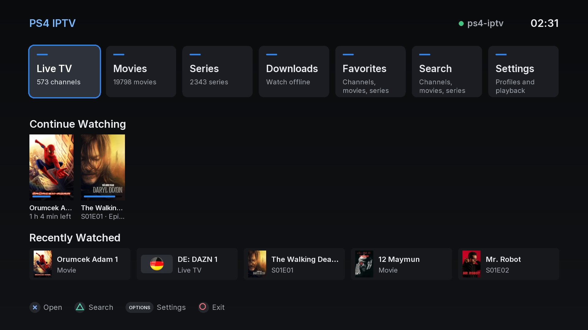
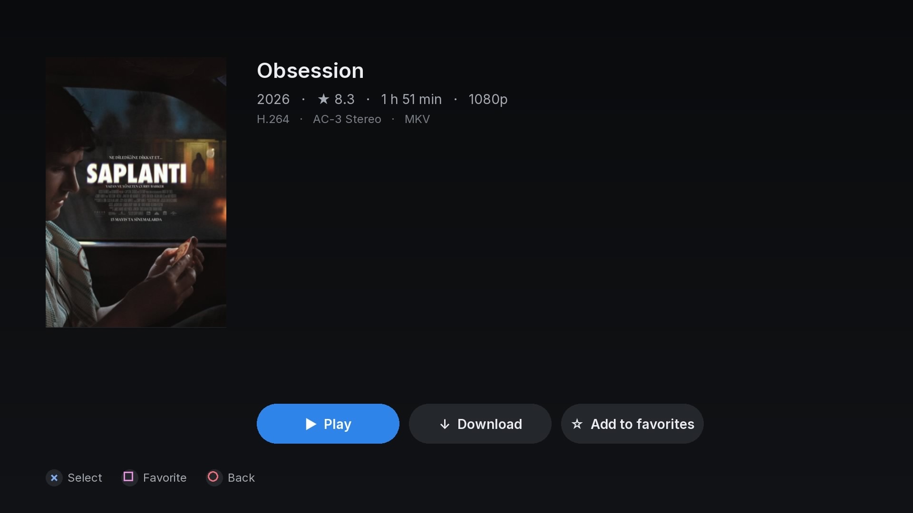
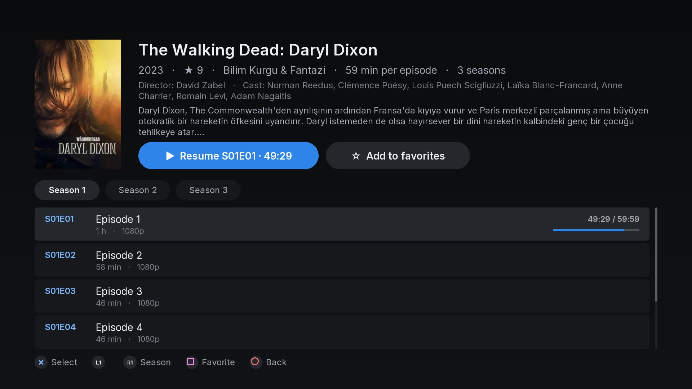
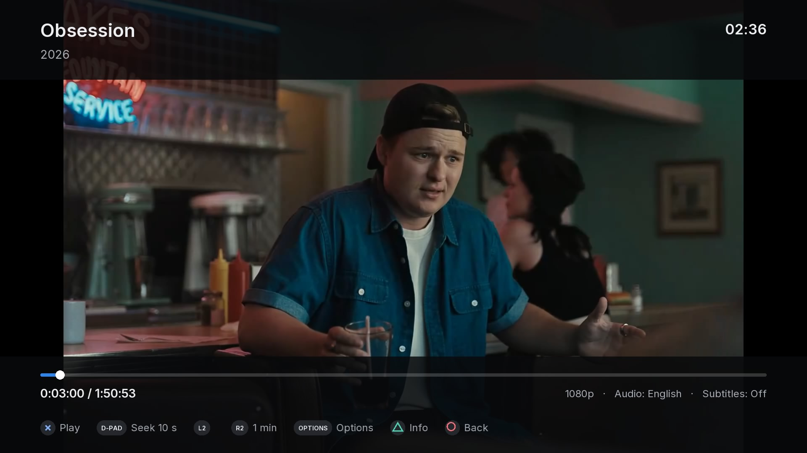
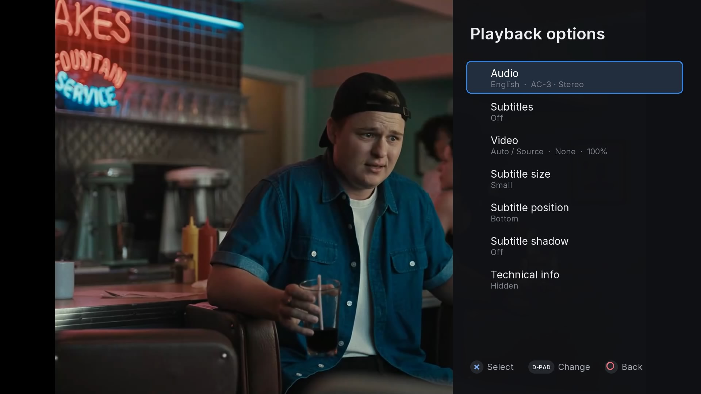
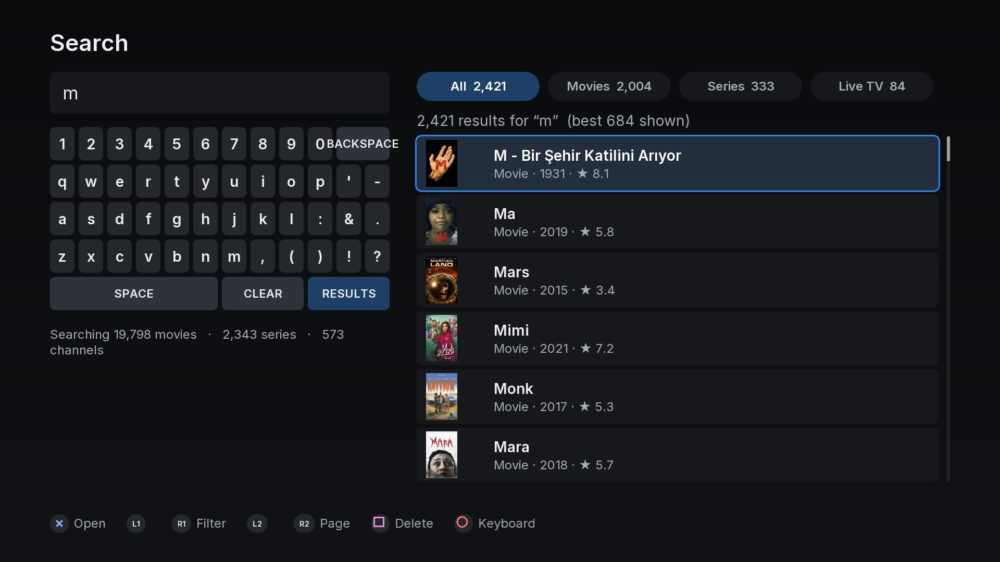
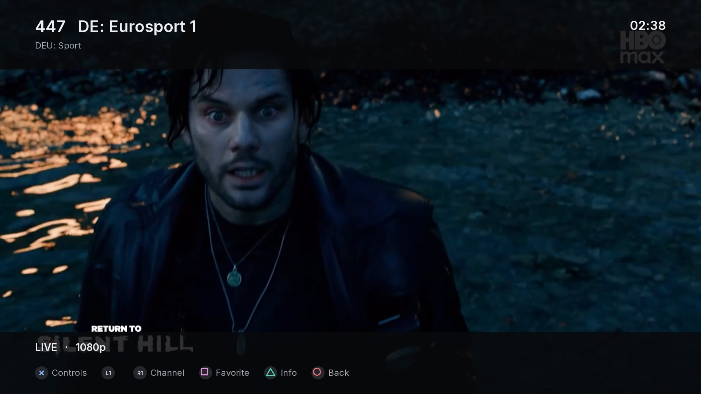
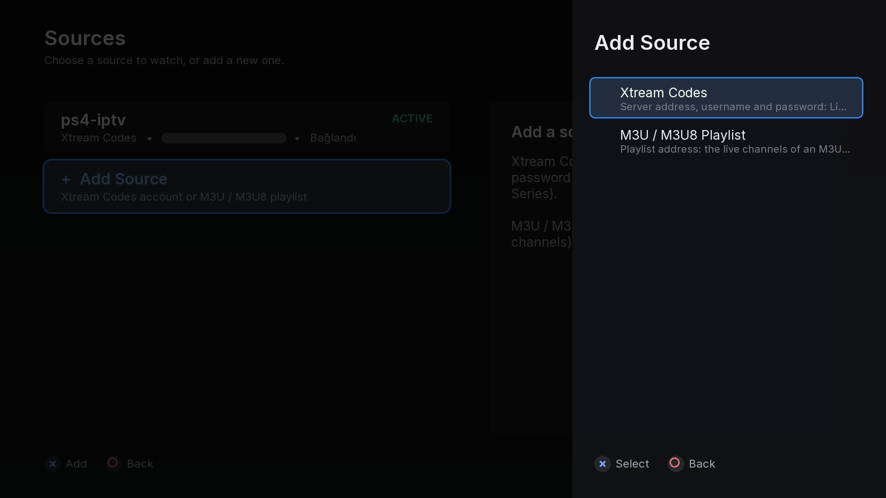

# PS4 IPTV

A native IPTV client for jailbroken PlayStation 4 systems, built for the TV and the DualShock 4.
Connect **your own Xtream Codes compatible service** or **your own M3U / M3U8 playlist** and watch live
channels and, from Xtream services, movies and series. Offline downloads are available for services that allow
storing content.

> **PS4 IPTV is a client only.** It ships with no channels, movies, series, accounts, credentials or playlists,
> and it is not affiliated with any IPTV provider. You need your own source and you are responsible for having
> permission to access, play and download its content.

<p align="center">
  
</p>

<table>
  <tr>
    <td width="50%"></td>
    <td width="50%"></td>
  </tr>
  <tr>
    <td align="center"><sub>Movie details</sub></td>
    <td align="center"><sub>Series, seasons and episodes</sub></td>
  </tr>
  <tr>
    <td></td>
    <td></td>
  </tr>
  <tr>
    <td align="center"><sub>Playback</sub></td>
    <td align="center"><sub>Playback options: audio, subtitles, aspect ratio / crop / zoom</sub></td>
  </tr>
  <tr>
    <td></td>
    <td></td>
  </tr>
  <tr>
    <td align="center"><sub>Search across Movies, Series and Live TV</sub></td>
    <td align="center"><sub>Live TV</sub></td>
  </tr>
  <tr>
    <td></td>
    <td></td>
  </tr>
  <tr>
    <td align="center"><sub>Sources: Xtream Codes or M3U / M3U8 (server address redacted)</sub></td>
    <td></td>
  </tr>
</table>

<sub>Screenshots were taken on a PS4 and show the client interface only. Channel names and logos, posters,
artwork and video frames come from the user's own source and belong to their respective owners; they are not
part of this project and are not distributed with it.</sub>

## Features

- **Sources**: Xtream Codes accounts and M3U / M3U8 playlists, as many as you like (see the table below)
- **Live TV**: categories, channel logos, favorites, fast zapping, MPEG-TS or HLS with automatic fallback
- **Movies and Series**: poster grids by category; details (plot, cast, rating, duration), seasons and episodes
- **Search** across Live TV, Movies and Series (Turkish letters, apostrophes and small typos are fine)
- **Sorting**: A–Z, newest added, year, rating, recently watched, provider order
- **Favorites** for channels, movies and series
- **Continue Watching** with exact resume, and **Recently Watched**; a card can be removed from Continue Watching
  without losing its position
- **Offline downloads** of movies and episodes to the console's internal storage, with **resume of interrupted
  downloads** and **offline playback**
- **Multiple audio tracks** and **embedded subtitles**, switchable during playback; preferred languages
- **Video geometry**: Aspect Ratio, Crop / Fill, Zoom and position, changed live during playback
- **Playback stability presets** with stall detection and bounded reconnects
- **DualShock 4 interface**: hold-to-scroll that accelerates, smoothly gliding lists and poster grids,
  controller hints on every screen, on-screen keyboard
- **Near-black TV design** with clear focus and readable contrast from the couch
- **English and Turkish** user interface (English by default; *Settings › Language*)
- **International channel and title names**: Latin, Greek, Cyrillic, Arabic, Hebrew, Armenian, Georgian,
  Japanese, Korean and Chinese characters (see *Known limitations*)

### What each source type supports

| | Xtream Codes | M3U / M3U8 playlist |
|---|---|---|
| Live TV, categories, logos | ✓ | ✓ (`group-title`, `tvg-logo`) |
| Movies, Series | ✓ | – (entries are always treated as live channels) |
| Search, Favorites, Recently Watched | ✓ | ✓ |
| Continue Watching, offline downloads | ✓ (Movies, episodes) | – |
| Account status and expiry | ✓ | – |

Playlist entries are never guessed to be movies or series. Use an Xtream Codes source for Movies, Series,
Continue Watching and downloads.

## Requirements

- A **jailbroken PS4** or another compatible homebrew environment that can install fake-signed PKG files.
  PS4 IPTV does not include or describe any exploit.
- **Your own source**: an Xtream Codes compatible service (server address, username, password) and/or the address
  of an M3U / M3U8 playlist you are entitled to use. The project provides no content, accounts or playlists.
- Network access for streaming; downloaded content plays offline.

## Installing

1. Download `IV0001-IPTV00002_00-IPTV000020002000.pkg` from the [Releases](../../releases) page (or build it
   yourself, below). Each release lists the PKG's SHA-256.
2. Install it with the package installer of your PS4 homebrew environment.
3. Start **PS4 IPTV**.
4. Choose **Add Source**, then **Xtream Codes** or **M3U / M3U8 Playlist**, and enter your details.

The app keeps its data in `/data/PS4IPTV/` on the console (sources, settings, history, caches, downloads).
Sources, including passwords and playlist addresses, are stored only on the console.

## Using the app

| Button | Action |
|---|---|
| ✕ | Select / open / play |
| ○ | Back |
| □ | Favorite; on an episode: download it; on a Continue Watching card: remove it from the row |
| △ | Search (Live TV, Movies, Series); in the player: technical info |
| OPTIONS | Settings (Home); sort & refresh (Movies, Series); Refresh Playlist / Playlist Info (playlist sources); source actions (Sources); playback options (player) |
| L1 / R1 | Previous / next category, season, tab or episode |
| L2 / R2 | Page up / down; in the player: seek 1 minute |
| D-pad ← → | Seek 10 seconds in the player |

Hold a direction to scroll quickly: after 0.3 s the list moves every 90 ms, then 60 ms, 40 ms and, after 3.5 s,
every 30 ms. A short press always moves exactly one item. *Settings › Smooth scrolling* turns the gliding
animation off.

### Playback options

Press OPTIONS while a movie or episode plays:

- **Audio** and **Subtitles**: every track the file contains, named by language; commentary and forced tracks
  are labelled.
- **Video**: four independent controls, applied instantly without restarting playback:
  - **Aspect Ratio**: Auto / Source, 16:9, 16:10, 4:3, 5:4, 1:1, 1.85, 2.21, 2.35, 2.39, 2.40. Never cuts anything.
  - **Crop / Fill**: *Fill Screen* fills the screen without distortion and cuts what does not fit; a ratio keeps
    only the centre of the picture in that shape (e.g. to remove black bars that are part of the video).
  - **Zoom** (100–150 %) and a horizontal / vertical **position** for a zoomed or cropped picture.
  - **Reset Video Geometry** returns to the defaults.
  Defaults are in Settings; a change in the panel applies to the current playback only (or *Set as default*).
- Subtitle size, position and shadow; technical information.

## M3U / M3U8 playlists

A playlist source is a **list of Live TV channels**. Add one with *Add Source › M3U / M3U8 Playlist*: a name and
the playlist address, for example `https://example.com/list.m3u`.

- **Addresses**: `http://` and `https://` playlist URLs (downloaded with libcurl: redirects, gzip, timeouts), or
  a file copied to `/data/PS4IPTV/playlists/` on the console. An optional **User-Agent** is sent with the
  playlist request and the streams.
- **Format**: Extended M3U - `#EXTM3U`, `#EXTINF` with `tvg-id`, `tvg-name`, `tvg-logo`, `group-title` and
  `tvg-chno`, `#EXTGRP`, `#EXTVLCOPT:http-user-agent`. UTF-8 with or without BOM, any line endings. A broken
  entry is skipped; the rest of the playlist still loads.
- **Categories**: Favorites, All Channels, then the playlist's groups in playlist order; channels without a group
  are under *Uncategorized*.
- **Saved copy and refresh**: the playlist is kept on the console and refreshed in the background when it is
  older than 12 hours (*Options › Refresh Playlist* refreshes now). A failed download never empties the list.
  *Options › Playlist Info* shows channel, group and logo counts and skipped entries, never the address.
- **Playback**: each channel's own URL (MPEG-TS, HLS and other HTTP streams) on the same player as Xtream
  channels. Channels with **HTTPS stream URLs cannot be played** in this version (see *Known limitations*); they
  show a clear message and Playlist Info counts them.

## Offline downloads

Movies and episodes from Xtream sources can be downloaded to the console's internal storage and watched later
without a connection.

- The provider's **original file** is stored byte for byte: every audio and subtitle track, nothing transcoded.
- Stored in `/data/PS4IPTV/downloads/`, named by content ID, never by title.
- One download at a time, in queue order, over HTTP(S). **Interrupted transfers resume** where they stopped
  (HTTP Range); a server that cannot resume is never appended to. After a network loss a download waits and
  continues by itself.
- Downloads **pause while a video plays**. Free space is checked before and during a download (at least 512 MB
  stay free); files larger than 4 GB are supported.
- **Offline mode**: when the provider cannot be reached at start-up, choose *Continue offline*; downloaded titles
  play without any request to the provider. Progress is shared between the stream and the download.
- *Settings › Diagnostics › Download diagnostics* shows the measured network and disk speed (no addresses or
  passwords).

**Use downloads only for services and content where you have permission to store content locally.** The feature
saves the files your service delivers to you; it does not remove DRM, decrypt content or circumvent any access
control.

## Known limitations

- **HTTPS media streams are not supported.** The bundled FFmpeg playback build has no TLS protocol, so streams are
  played over HTTP (also RTMP / UDP / RTP). This affects HTTPS entries in M3U playlists and HTTPS stream URLs in
  general. The Xtream API, playlist downloads, images and offline downloads use libcurl and do work over HTTPS.
- **M3U / M3U8 sources are Live TV only**: no movie / series detection, Continue Watching or downloads.
- No EPG / programme guide, recording or timeshift.
- Video is decoded in software; very high bitrates or 4K may not play smoothly.
- **Scripts**: Thai, Devanagari and other Indic scripts, emoji and rare CJK characters are not covered and show a
  box. Arabic and Hebrew are reordered right-to-left with basic Arabic joining (FriBidi), not full OpenType
  shaping; the interface itself stays left-to-right.
- **Subtitles** are drawn with the interface font: subtitles in scripts other than Latin, Greek and Cyrillic
  cannot be drawn.
- Provider metadata (titles, channel names, categories, plots) is shown exactly as the provider sends it,
  regardless of the interface language.

## Building from source

Builds run **natively on Windows 11** with PowerShell. No WSL, VM or Docker is needed.

The toolchain reproduces [pPlay](https://github.com/Cpasjuste/pplay)'s PS4 build: **LLVM/Clang 12.0.1**,
**CMake 3.31**, **Ninja**, **pkgconf**, the **PacBrew PS4 sysroot** (musl, libc++, SDL2, libmpv 0.34.1,
FFmpeg 5.0, libcurl 7.80 + Mbed TLS, ...) and the **OpenOrbis** tools (`create-fself`, `create-gp4`, built with
Go) plus **LibOrbisPkg** `PkgTool.Core` for the PKG. `scripts\setup-toolchain.ps1` downloads all of them,
checks each against a pinned SHA-256 and unpacks them into `toolchain\` inside the repository (git-ignored).
Nothing is added to PATH; only LLVM's official installer needs one administrator (UAC) prompt.

Prerequisites: Windows 11, PowerShell 5.1, Git, Python 3, the .NET runtime (for PkgTool.Core) and, for the host
tests only, Visual Studio 2022 Build Tools with the Windows SDK. The first setup downloads about 0.5 GB.

```powershell
git clone https://github.com/realityofai32-stack/PS4-IPTV.git
cd PS4-IPTV
powershell -ExecutionPolicy Bypass -File scripts\setup-toolchain.ps1        # once: toolchain\ (pinned, verified)
powershell -ExecutionPolicy Bypass -File scripts\build-pplay-reference.ps1  # once: pPlay checkout + reference build
powershell -ExecutionPolicy Bypass -File scripts\build-ps4iptv.ps1          # -> build\ps4iptv-release\*.pkg
```

`build-pplay-reference.ps1` clones pPlay at a pinned commit into `external\pplay-reference`. PS4 IPTV compiles
libcross2d and two pPlay sources from that checkout and copies pPlay's PS4 system modules into the PKG, so this
step is required. The reference pPlay build also serves as the baseline for the release checks.

### Tests and release validation

```powershell
powershell -ExecutionPolicy Bypass -File scripts\run-host-tests.ps1                # unit tests (MSVC)
powershell -ExecutionPolicy Bypass -File scripts\run-download-integration-test.ps1 # host libcurl (built on first run) + local HTTP server
powershell -ExecutionPolicy Bypass -File scripts\verify-ps4iptv.ps1                # full release validation
```

`verify-ps4iptv.ps1` rebuilds from clean and checks: zero errors and warnings, all host tests, the localization
checks, the download integration test, `pkg_validate`, an exact allow-list of packaged files, a secret scan of
the extracted PKG and of the complete Git history, the linked system modules (against the pPlay reference build)
and that no diagnostic screen can open by itself.

The secret scans compare against values only you know. Put any private value (your server host, username,
password, playlist address) one per line in `config/forbidden_strings.txt`, or a test stream URL in
`config/test_streams.txt` (see `config/test_streams.example.txt`). Both files are git-ignored. Without either
file the history scan reports that it has nothing to compare against and the validation fails on purpose.

### Keeping credentials out of the repository

`config/test_streams.txt`, `config/forbidden_strings.txt` and all `*.m3u` / `*.m3u8` files are git-ignored (only
the sanitized parser fixtures in `tests/fixtures/m3u/`, which use example hosts, are tracked). The build fails if
any of those values or any playlist file would end up in the PKG, and `scripts/scan-git-history.py` checks every
commit for them, for authenticated-looking stream URLs and for playlists outside the fixtures, without printing
any of them.

## Project layout

```
src/app/          application shell, services (Xtream, catalogs, progress, offline glue)
src/core/         shared helpers: JSON, URLs, UTF-8, formatting
src/downloads/    download engine: manifest, resumable transfers (libcurl), queue, storage checks
src/i18n/         localization tables (English, Turkish)
src/images/       channel logo / poster loading, decoding, disk and memory cache
src/iptv/         Xtream API and Extended M3U parsing, catalogs, search index, sorting
src/network/      HTTP client (libcurl) and background jobs
src/player/       playback adapter over pPlay's mpv wrapper, tracks, stability, video geometry
src/platform/     PS4 / host platform glue, controller input
src/screens/      TV screens
src/storage/      JSON stores on the console (sources, settings, favorites, history)
src/ui/           theme, UTF-8 text rendering with fallback fonts, widgets, on-screen keyboard
tests/host/       host unit tests, download and playlist integration tests
tests/fixtures/   sanitized M3U parser fixtures
scripts/          toolchain setup, build, tests, release validation
cmake/            Windows PS4 toolchain file, PKG credential scan
third_party/      bundled fonts and their licenses
docs/             screenshots and the hardware test checklists used for each checkpoint
```

**Adding a language**: copy `src/i18n/strings_en.cpp`, translate every entry (keep the keys and the `{0}`
placeholders) and register it in `src/i18n/i18n.cpp`. The host tests reject missing keys, blank text, mismatched
placeholders and screen text that bypasses the tables.

See [CONTRIBUTING.md](CONTRIBUTING.md) for bug reports and pull requests, and [SECURITY.md](SECURITY.md) for
reporting credential leaks or security issues.

## License

PS4 IPTV is free software under the **GNU General Public License v3.0 or later**; see [LICENSE](LICENSE).
It builds on pPlay and libcross2d (GPL-3.0, Cpasjuste), mpv, FFmpeg, SDL2, libass, FreeType, FriBidi, libcurl,
Mbed TLS, stb_image, the OpenOrbis PS4 Toolchain and PacBrew's PS4 ports, and the Inter, DejaVu Sans and Droid
Sans Fallback typefaces. [NOTICE](NOTICE) lists every component with its authors and license.

Each GitHub release is built from the tagged source. The tag is the complete corresponding source of the
released PKG, together with the pinned upstream components that the build scripts download.

PlayStation and DualShock are trademarks of Sony Interactive Entertainment Inc. This project is not affiliated
with or endorsed by Sony.
